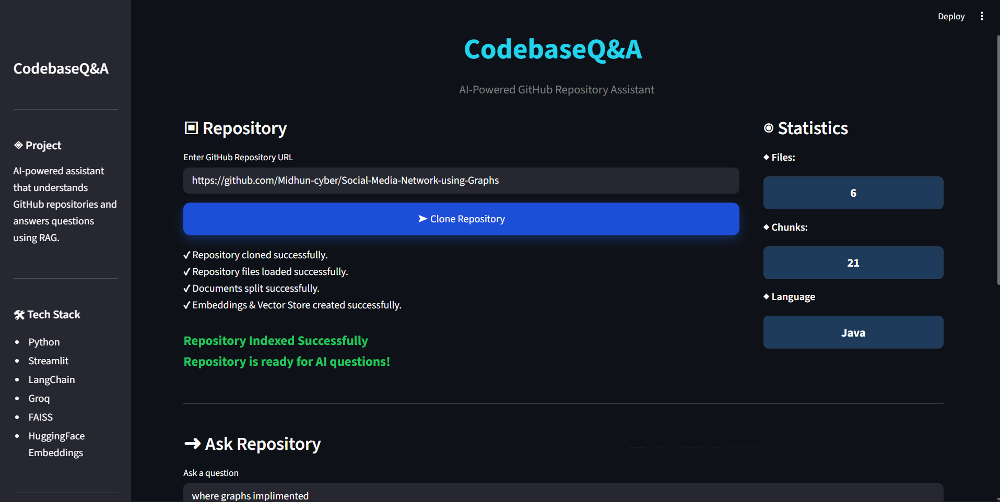
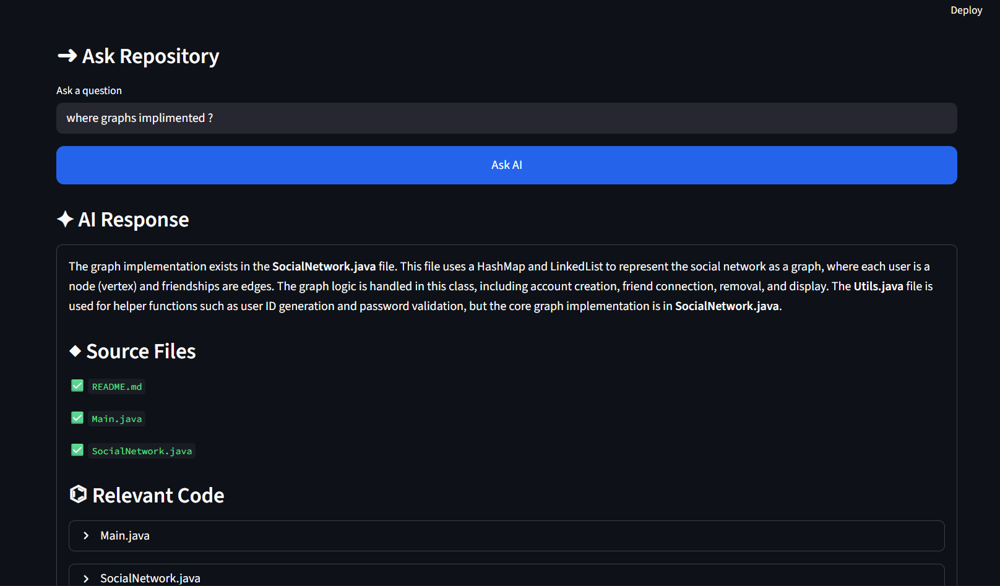
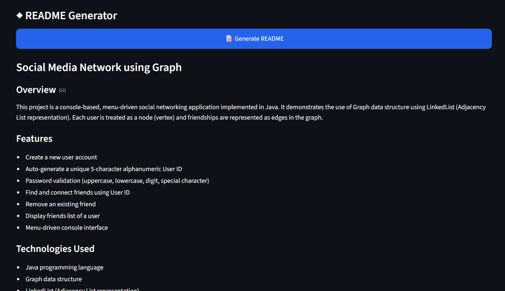

# 🤖 CodebaseQ&A: Ask Your Repository


### 🚀 AI-Powered GitHub Repository Assistant

Understand any GitHub repository instantly using **Retrieval-Augmented Generation (RAG)**.
Ask questions in natural language, receive AI-generated answers, explore relevant source code, and automatically generate professional README documentation.

---

# 📚 Table of Contents

- Overview
- Features
- Architecture
- Workflow
- Tech Stack
- Project Structure
- Installation
- Usage
- Repository Statistics
- AI README Generator
- Screenshots
- Future Enhancements
- License
- Author

---

# 📖 Overview

Reading an unfamiliar GitHub repository can be overwhelming.

Developers often spend hours trying to understand:

- Project architecture
- Folder structure
- Important files
- Business logic
- Code flow
- Documentation

**CodebaseQ&A** solves this problem by combining **Large Language Models**, **Vector Databases**, and **Retrieval-Augmented Generation (RAG)**.

Instead of manually reading hundreds of files, users simply ask questions like:

> Where is the login implemented?

> Explain the authentication flow.

> How does the payment system work?

The application searches the repository, retrieves the most relevant code, and generates an accurate AI response based only on the repository content.

---

# ✨ Features

## 📂 Repository Management

- Clone any public GitHub repository
- Automatically detect repository language
- Read source code recursively
- Ignore unnecessary files
- Smart indexing

---

## 🧠 AI Repository Assistant

- Ask repository-related questions
- AI-generated explanations
- Repository-aware responses
- Context-aware answers
- Natural language interface

---

## 🔍 Intelligent Code Search

- Semantic code search
- Retrieves relevant code chunks
- Displays matching source files
- Shows exact code used for answering

---

## 📊 Repository Statistics

Automatically displays:

- Total Files
- Total Chunks
- Primary Programming Language

---

## 📄 AI README Generator

Generate a complete README.md file automatically.

Includes:

- Project Description
- Features
- Installation
- Usage
- Tech Stack
- Folder Structure

Download it instantly.

---

## 🎨 Professional Interface

- Modern Streamlit UI
- Interactive workflow
- Progress indicators
- Expandable code viewer
- Responsive layout

---

# 🏗️ System Architecture

```text
                    GitHub Repository
                            │
                            ▼
                  Clone Repository
                            │
                            ▼
                Read Repository Files
                            │
                            ▼
                 Split Into Chunks
                            │
                            ▼
          HuggingFace Embeddings
                            │
                            ▼
                 FAISS Vector Store
                            │
                            ▼
                 User Question
                            │
                            ▼
                Semantic Retrieval
                            │
                            ▼
                    Relevant Chunks
                            │
                            ▼
                      Groq LLM
                            │
                            ▼
                 AI Generated Answer
                            │
                            ▼
      Source Files + Relevant Code Viewer
```

---

# 🔄 Workflow

```text
User
 │
 ▼
Enter GitHub Repository URL
 │
 ▼
Clone Repository
 │
 ▼
Read Repository
 │
 ▼
Split Documents
 │
 ▼
Generate Embeddings
 │
 ▼
Store in FAISS
 │
 ▼
Ask Repository Questions
 │
 ▼
Retrieve Relevant Chunks
 │
 ▼
Groq LLM
 │
 ▼
AI Answer
 │
 ├────────► Source Files
 │
 └────────► Relevant Code
```

---

# ⚡ Key Highlights

✅ Retrieval-Augmented Generation (RAG)

✅ Vector Database (FAISS)

✅ HuggingFace Embeddings

✅ Groq LLM Integration

✅ Semantic Search

✅ AI README Generator

✅ GitHub Repository Analysis

✅ Streamlit Dashboard

---
# 🛠️ Tech Stack

| Category | Technology |
|----------|------------|
| Language | Python 3.10+ |
| Framework | Streamlit |
| LLM | Groq (Llama 3) |
| Embeddings | HuggingFace Sentence Transformers |
| Vector Database | FAISS |
| AI Framework | LangChain |
| Version Control | Git & GitHub |
| Repository Access | GitPython |
| Environment | Python Virtual Environment |

---

# 📂 Project Structure

```text
CodebaseQnA/
│
├── app.py                    # Streamlit application
├── utils.py                  # Repository cloning & processing
├── rag.py                    # Retrieval-Augmented Generation
├── groqai.py                 # LLM & README generation
│
├── repositories/             # Cloned GitHub repositories
│
├── vector_store/             # FAISS database
│
├── requirements.txt
├── README.md
└── .gitignore
```

---

# ⚙️ Installation

## 1️⃣ Clone the Repository

```bash
git clone https://github.com/yourusername/CodebaseQnA.git

cd CodebaseQnA
```

---

## 2️⃣ Create Virtual Environment

Windows

```bash
python -m venv .venv
```

Activate

```bash
.venv\Scripts\activate
```

Linux / macOS

```bash
python3 -m venv .venv

source .venv/bin/activate
```

---

## 3️⃣ Install Dependencies

```bash
pip install -r requirements.txt
```

---

## 4️⃣ Configure API Key

Create a `.env` file.

```env
GROQ_API_KEY=YOUR_API_KEY
```

---

## 5️⃣ Run Application

```bash
streamlit run app.py
```

---

# 🚀 Usage

### Step 1

Launch the application.

---

### Step 2

Paste a GitHub repository URL.

Example

```text
https://github.com/username/repository
```

---

### Step 3

Click

```
Clone Repository
```

The application will

- Clone repository
- Read files
- Split documents
- Generate embeddings
- Create FAISS vector database

---

### Step 4

Ask repository questions.

Example

```text
Where is the login implemented?
```

```text
Explain authentication flow.
```

```text
How does this project work?
```

```text
Which file contains database logic?
```

---

### Step 5

Receive

- AI-generated answer
- Relevant source files
- Code snippets used to answer

---

# 📊 Repository Statistics

The application automatically displays

- 📁 Total Files

- 📄 Total Chunks

- 💻 Primary Programming Language

Example

```text
Files          : 125

Chunks         : 540

Language       : Python
```

---

# 📄 AI README Generator

One click generates a professional README.

The generated README includes

- Project Overview

- Features

- Installation

- Usage

- Tech Stack

- Folder Structure

- Future Improvements

The README can also be downloaded directly.

---

# 🧠 How RAG Works

```text
Repository Files
        │
        ▼
Read Source Code
        │
        ▼
Split into Chunks
        │
        ▼
Generate Embeddings
        │
        ▼
Store in FAISS
        │
        ▼
User Question
        │
        ▼
Semantic Search
        │
        ▼
Relevant Chunks
        │
        ▼
Groq LLM
        │
        ▼
AI Response
```

---

# 📸 Screenshots

## Home Page

> 

---


## AI Repository Question

> 
---

## README Generator

> 
---

# 📦 Main Dependencies

```text
streamlit
langchain
langchain-community
faiss-cpu
sentence-transformers
GitPython
python-dotenv
groq
transformers
torch
```

---

# 🔐 Supported Languages

- Python
- Java
- JavaScript
- TypeScript
- C
- C++
- HTML
- CSS

More languages can easily be added by extending the repository parser.
---

# 🌟 Why CodebaseQ&A?

Understanding an unfamiliar codebase is one of the biggest challenges for developers, students, and open-source contributors.

Instead of manually exploring hundreds of files, **CodebaseQ&A** enables users to interact with a repository using natural language.

Simply ask questions like:

- Where is the login implemented?
- Explain the authentication flow.
- Which file handles database operations?
- How does this application work?

The application intelligently retrieves the most relevant code using **Retrieval-Augmented Generation (RAG)** and generates accurate, repository-aware responses.

---

# 🎯 Use Cases

### 👨‍💻 Developers

- Understand unfamiliar repositories quickly
- Navigate large codebases
- Locate important files

### 🎓 Students

- Learn project architecture
- Understand implementation details
- Explore open-source projects

### 👥 Teams

- Reduce onboarding time
- Improve code understanding
- Increase development productivity

### 🤖 AI Engineers

- Repository-aware chatbot
- Documentation assistant
- Intelligent code search

---

# 🚀 Future Enhancements

The following features are planned for future releases.

## Repository Insights

- AI Code Review
- Best Practices Detection
- Code Quality Score
- Security Suggestions

---

## Dependency Analysis

- Dependency Graph
- Import Visualization
- Module Relationships

---

## AI Repository Summary

Automatically generate

- Project Summary
- Architecture Overview
- Main Components
- Tech Stack
- Folder Explanation

---

## Advanced Search

- Function Search
- Class Search
- Variable Search
- Semantic File Search

---

## Multi-Repository Support

- Compare repositories
- Cross-project search
- Shared vector database

---

## Export Options

- PDF Documentation
- HTML Documentation
- Architecture Report
- Repository Summary Report

---

## Additional Language Support

- Go
- Rust
- Kotlin
- Swift
- PHP
- Ruby
- C#
- Dart

---

# 📈 Performance

The application is optimized for medium to large repositories.

Features include:

- Efficient document chunking
- FAISS vector indexing
- Semantic retrieval
- Fast similarity search
- Lightweight Streamlit interface

---

# 🤝 Contributing

Contributions are welcome.

If you'd like to improve this project:

1. Fork the repository

2. Create a new branch

```bash
git checkout -b feature/NewFeature
```

3. Commit your changes

```bash
git commit -m "Added new feature"
```

4. Push to your branch

```bash
git push origin feature/NewFeature
```

5. Open a Pull Request

---

# 📝 License

This project is licensed under the **MIT License**.

You are free to use, modify, and distribute this project in accordance with the license terms.

---

# 🙏 Acknowledgements

This project was built using the following amazing technologies.

- Streamlit
- LangChain
- Groq
- HuggingFace
- FAISS
- GitPython
- Python

Special thanks to the open-source community for providing these incredible tools.

---

# 👨‍💻 Author

**Midhun V S**

B.Tech Computer Science Engineering (Data Science)

Lovely Professional University

---

# ⭐ If you found this project useful...

Please consider giving it a ⭐ on GitHub.

It motivates further development and helps others discover the project.

---

<div align="center">

## 🚀 CodebaseQ&A

### Ask Your Repository. Understand Any Codebase Instantly.

Built with ❤️ using Python, Streamlit, LangChain, FAISS, HuggingFace Embeddings, and Groq LLM.

</div>